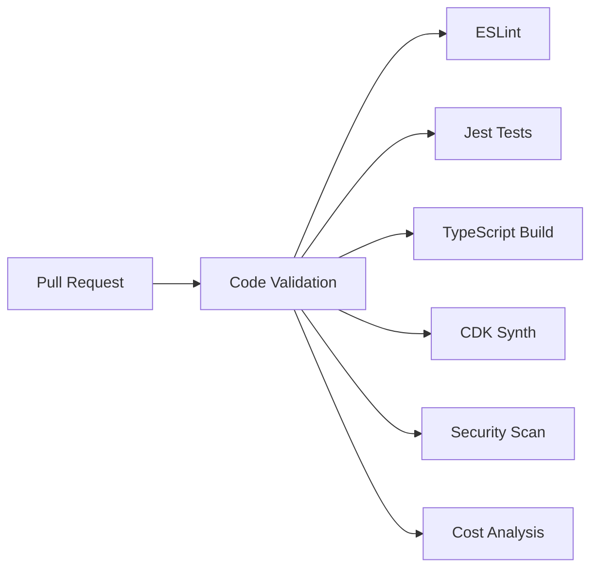
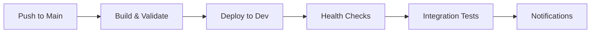
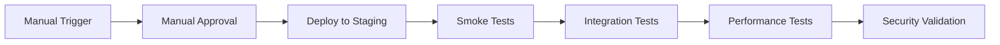
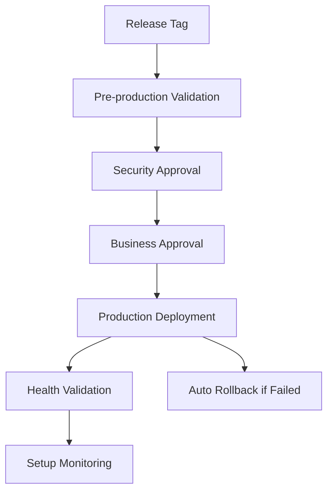
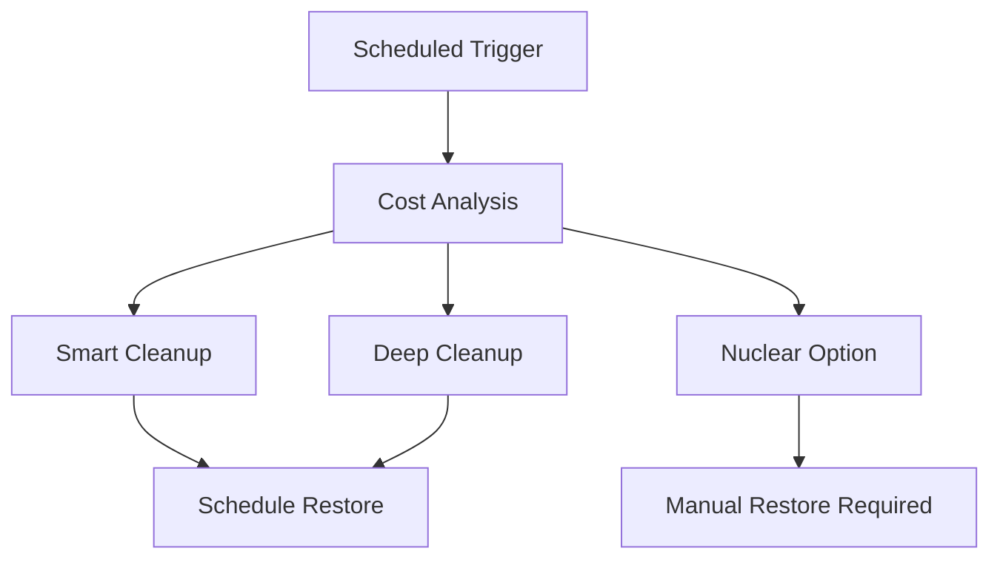

# GitHub Actions Workflows

This directory contains CI/CD workflows for AWS Control Tower + CDK multi-account deployment.

## 🚀 Quick Start

### Prerequisites
1. AWS Control Tower setup complete
2. GitHub repository secrets configured
3. AWS OIDC identity provider configured
4. Environment protection rules enabled

### Required Secrets
```
AWS_REGION=ap-southeast-1
DEV_ACCOUNT_ID=803133978889
STAGING_ACCOUNT_ID=521744733620
SHARED_ACCOUNT_ID=216665870694  
PROD_ACCOUNT_ID=668427974646
SLACK_WEBHOOK=https://hooks.slack.com/... (optional)
```

## 📋 Workflow Overview

| Workflow | Trigger | Purpose | Duration |
|----------|---------|---------|----------|
| **ci.yml** | Pull requests, pushes | Code validation & testing | 3-5 min |
| **deploy-dev.yml** | Push to main | Auto-deploy to development | 5-8 min |
| **deploy-staging.yml** | Manual trigger | Deploy to staging with approval | 8-12 min |
| **deploy-production.yml** | Manual trigger | Production deployment with gates | 15-20 min |
| **cost-optimization.yml** | Scheduled/manual | Smart cost management | 2-5 min |

## 🔄 CI/CD Flow

### 1. Continuous Integration (CI)
**File**: `ci.yml`  
**Triggers**: Pull requests, pushes to any branch



**Features**:
- ✅ Code linting and formatting
- ✅ Unit test execution
- ✅ TypeScript compilation
- ✅ CDK synthesis validation
- ✅ Security vulnerability scanning
- ✅ Cost impact analysis
- ✅ CDK diff for pull requests

### 2. Development Deployment (CD)
**File**: `deploy-dev.yml`  
**Triggers**: Push to main branch



**Features**:
- 🔧 Automatic deployment to development
- 🩺 Comprehensive health checks
- 🧪 Integration test execution
- 📊 Performance baseline collection
- 💰 Cost optimization reminders
- 🔔 Slack notifications

### 3. Staging Deployment
**File**: `deploy-staging.yml`  
**Triggers**: Manual workflow dispatch



**Features**:
- 🎯 Manual deployment trigger
- ⏳ Approval gates
- 💨 Comprehensive smoke testing
- 🧪 Production-like validation
- 📊 Performance benchmarking
- 🔒 Security compliance checks

### 4. Production Deployment
**File**: `deploy-production.yml`  
**Triggers**: Manual workflow dispatch (release tags only)



**Features**:
- 🏷️ Release tag validation
- 🔒 Multiple approval gates
- 💾 Automatic backup creation
- 🩺 Comprehensive health checks
- 📊 Performance validation
- 🔄 Automatic rollback capability
- 📈 Production monitoring setup

### 5. Cost Optimization
**File**: `cost-optimization.yml`  
**Triggers**: Scheduled (weekdays 6PM, weekends 8AM) + manual



**Features**:
- ⏰ Automated cost optimization scheduling
- 💰 Smart savings (99% cost reduction)
- 🧹 Multiple cleanup levels
- 🔄 Automatic restoration scheduling
- 📊 Cost impact reporting
- 🔔 Notification integration

## 🔐 Security & Authentication

### AWS OIDC Configuration
```yaml
# IAM Identity Provider
Provider: token.actions.githubusercontent.com
Audience: sts.amazonaws.com
Thumbprint: 6938fd4d98bab03faadb97b34396831e3780aea1
```

### Per-Environment IAM Roles
```
arn:aws:iam::DEV_ACCOUNT_ID:role/GitHubActions-Dev-Role
arn:aws:iam::STAGING_ACCOUNT_ID:role/GitHubActions-Staging-Role
arn:aws:iam::SHARED_ACCOUNT_ID:role/GitHubActions-Shared-Role
arn:aws:iam::PROD_ACCOUNT_ID:role/GitHubActions-Production-Role
```

### Environment Protection Rules
- **Development**: No restrictions
- **Staging**: Required reviewers (1)
- **Production**: Required reviewers (2), deployment branch restriction
- **Production-approval**: Additional approval layer

## 💰 Cost Management Integration

### Automated Optimization Schedule
```yaml
# Weekdays: Cleanup at 6 PM Singapore time
- cron: '0 10 * * 1-5'  # 10 AM UTC = 6 PM SGT

# Weekends: Full cleanup at 8 AM Singapore time  
- cron: '0 0 * * 6-0'   # Midnight UTC = 8 AM SGT
```

### Cost Optimization Levels
| Level | Applications | Infrastructure | CDK Bootstrap | Savings |
|-------|-------------|----------------|---------------|---------|
| **Smart** | ❌ Destroyed | ✅ Preserved | ✅ Preserved | 99% |
| **Deep** | ❌ Destroyed | ❌ Destroyed | ✅ Preserved | 99% |
| **Nuclear** | ❌ Destroyed | ❌ Destroyed | ❌ Destroyed | 100% |

### Quick Restoration
```bash
# After smart cleanup (2 minutes)
cdk deploy --all

# After deep cleanup (15 minutes)  
./scripts/up.sh

# After nuclear cleanup (1.5 hours)
# Complete Control Tower + CDK setup required
```

## 🚦 Environment Flow

### Development Workflow
```
Feature Branch → Pull Request → CI Validation → Merge to Main → Auto Deploy Dev
```

### Staging Promotion
```
Development Testing → Manual Staging Trigger → Approval → Deploy Staging → UAT
```

### Production Release
```
Staging Validation → Release Tag → Production Trigger → Multi-Approval → Deploy Production
```

## 📊 Monitoring & Observability

### Deployment Metrics
- ⏱️ Deployment duration tracking
- 🩺 Health check response times
- 📊 Performance baseline metrics
- 💰 Cost impact per deployment

### Notification Channels
- 📧 GitHub environment notifications
- 💬 Slack integration (optional)
- 📊 CloudWatch monitoring alerts
- 📋 Deployment record creation

## 🛠️ Customization Guide

### Adding New Environments
1. Create new account in Control Tower
2. Add account ID to repository secrets
3. Create new workflow file (copy from staging)
4. Update environment protection rules
5. Configure IAM roles for new account

### Modifying Deployment Strategy
```yaml
# In workflow files, update deployment section:
deployment_strategy:
  type: choice
  options:
    - standard      # Direct deployment
    - blue-green    # Zero-downtime deployment
    - canary        # Gradual traffic shift
```

### Custom Validation Steps
```yaml
# Add to any workflow:
- name: Custom Validation
  run: |
    echo "Running custom validation..."
    # Add your validation logic here
    ./scripts/custom-validation.sh
```

### Environment-Specific Configuration
```yaml
# Environment matrix for multi-account deployment:
strategy:
  matrix:
    environment: [development, staging, shared, production]
    include:
      - environment: development
        memory: 128
        timeout: 10
      - environment: staging  
        memory: 256
        timeout: 15
```

## 🚀 Advanced Features

### Blue-Green Deployment
- Parallel stack deployment
- Traffic switching validation
- Automatic rollback capability
- Zero-downtime updates

### Canary Releases
- Gradual traffic percentage shifts
- Performance monitoring during rollout
- Automatic rollback on errors
- A/B testing capability

### Multi-Region Support
```yaml
strategy:
  matrix:
    region: [ap-southeast-1, ap-southeast-2]
    environment: [staging, production]
```

### Integration Testing
- Cross-environment API testing
- Database migration validation
- External service integration checks
- End-to-end user journey tests

## 🔧 Troubleshooting

### Common Issues

#### Authentication Failures
```bash
# Check OIDC configuration
aws sts get-caller-identity

# Verify role trust relationship
# Ensure GitHub repository has correct permissions
```

#### CDK Bootstrap Issues
```bash
# Check bootstrap status
aws cloudformation describe-stacks --stack-name cdktoolkit

# Re-bootstrap if needed
cdk bootstrap --qualifier cdk2024
```

#### Health Check Failures
```bash
# Check API Gateway status
aws apigatewayv2 get-apis

# Verify Lambda function
aws lambda get-function --function-name hello-world-function
```

#### Cost Optimization Issues
```bash
# Check current costs
aws ce get-cost-and-usage --time-period Start=2024-01-01,End=2024-12-31

# Verify cleanup completion
aws cloudformation list-stacks --stack-status-filter DELETE_COMPLETE
```

### Debug Mode
Enable verbose logging in any workflow:
```yaml
env:
  ACTIONS_STEP_DEBUG: true
  ACTIONS_RUNNER_DEBUG: true
```

## 📚 Additional Resources

- [GitHub Actions Documentation](https://docs.github.com/en/actions)
- [AWS CDK Documentation](https://docs.aws.amazon.com/cdk/)
- [AWS Control Tower User Guide](https://docs.aws.amazon.com/controltower/)
- [Cost Optimization Best Practices](../BUDGETS.md)
- [Multi-Account Strategy Guide](../CI_CD_FLOW.md)

## 🎯 Best Practices

### Security
- ✅ Use OIDC instead of long-term credentials
- ✅ Implement least privilege IAM policies
- ✅ Enable environment protection rules
- ✅ Regular security scanning
- ✅ Audit trail maintenance

### Performance
- ✅ Parallel deployment execution
- ✅ Efficient caching strategies
- ✅ Minimal container images
- ✅ Optimized dependency management
- ✅ Smart workflow triggers

### Cost Management
- ✅ Automated cleanup scheduling
- ✅ Environment-specific resource sizing
- ✅ Smart savings strategies
- ✅ Regular cost monitoring
- ✅ Quick restoration capabilities

### Reliability
- ✅ Comprehensive health checks
- ✅ Automatic rollback mechanisms
- ✅ Multi-layer validation
- ✅ Monitoring and alerting
- ✅ Disaster recovery planning