# 🚀 AWS Multi-Account Serverless Application

Production-ready serverless application with automated CI/CD pipeline across AWS Control Tower multi-account setup.

## 🏗️ **Architecture Overview**

```mermaid
graph TB
    subgraph "CI/CD Pipeline"
        GitHub["📁 GitHub Actions"] --> Dev["🎯 Development"]
        Dev --> Staging["🧪 Staging"] 
        Staging --> Prod["🚀 Production"]
    end
    
    subgraph "AWS Accounts"
        DevAccount["🔧 Dev Account<br/>803133978889"]
        StagingAccount["🧪 Staging Account<br/>521744733620"]
        SharedAccount["🔄 Shared Account<br/>216665870694"]
        ProdAccount["🚀 Prod Account<br/>668427974646"]
    end
    
    Dev --> DevAccount
    Staging --> StagingAccount
    Prod --> ProdAccount
```



## 📋 **Quick Start**

### Prerequisites
- AWS Control Tower setup (7 accounts)
- GitHub repository
- Node.js 22+
- AWS CDK 2.x

### Development Setup
```bash
# Clone and install
git clone <repository>
npm install

# Deploy to development
cdk deploy ctone-dev

# Test locally
npm test
npm run lint
```

## 🔧 **Available Commands**

| Command | Description |
|---------|-------------|
| `npm run build` | Compile TypeScript |
| `npm test` | Run unit tests |
| `npm run lint` | Code linting |
| `cdk synth` | Generate CloudFormation |
| `cdk deploy <stack>` | Deploy to AWS |
| `./scripts/up.sh` | Restore all environments |
| `./scripts/down.sh` | Destroy for cost savings |

## 🌍 **Environments**

| Environment | Account ID | Purpose | Cost/Month |
|-------------|------------|---------|------------|
| Development | 803133978889 | Developer testing | $2-5 |
| Staging | 521744733620 | UAT & integration | $3-6 |
| Shared | 216665870694 | Cross-account resources | $3-6 |
| Production | 668427974646 | Live application | $4-8 |

**💰 Cost Optimization**: Use `./scripts/down.sh` to reduce costs by 99% when not developing.

## 🚀 **CI/CD Pipeline**

### Automatic Triggers
- **Pull Request** → CI validation
- **Merge to main** → Deploy to development
- **Manual trigger** → Deploy to staging/production

### Deployment Flow
```
Code → PR → CI Tests → Merge → Dev Deploy → Manual Staging → Manual Production
```

### Pipeline Features
- ✅ Automated testing and linting
- ✅ Multi-environment deployment
- ✅ Cost optimization integration
- ✅ Security validation
- ✅ Performance monitoring
- ✅ Automatic rollback capability

## 📊 **Monitoring & Costs**

### Current Spending
- **Total Active**: $35-70/month
- **With Optimization**: $0.10/month (99% savings)
- **Free Tier Usage**: Normal for Control Tower setup

### S3 Alerts
The AWS free tier S3 alerts are **normal and expected** for Control Tower setups due to:
- CloudTrail organization logging across 7 accounts
- Config service recording across all accounts
- Multi-account governance overhead

## 🔧 **Key Files Structure**

```
├── lib/
│   ├── constructs/           # Reusable CDK constructs
│   ├── lambda/              # Lambda function code
│   ├── config/              # Account configurations
│   └── stacks/              # CDK stack definitions
├── .github/workflows/       # CI/CD pipeline
├── scripts/                 # Automation scripts
└── tests/                   # Unit tests
```

## 🎯 **Development Workflow**

### 1. Feature Development
```bash
git checkout -b feature/my-feature
# Make changes
npm test && npm run lint
git commit -m "feat: description"
git push origin feature/my-feature
```

### 2. Create Pull Request
- Automatic CI validation runs
- Code review required
- Security and cost analysis

### 3. Deploy & Test
- Merge triggers automatic dev deployment
- Manual promotion to staging
- UAT and business approval
- Manual production deployment

## 💡 **Common Operations**

### Cost Management
```bash
# Save costs (destroy applications, keep infrastructure)
./scripts/down.sh

# Restore environments quickly
./scripts/up.sh

# Check current status
npm run status
```

### Manual Deployments
```bash
# Deploy specific environment
cdk deploy ctone-dev
cdk deploy ctone-staging  
cdk deploy ctone-prod

# Deploy all environments
cdk deploy --all
```

### Troubleshooting
```bash
# Check logs
aws logs tail /aws/lambda/ctone-dev

# Verify bootstrap
aws cloudformation describe-stacks --stack-name cdktoolkit

# Test endpoints
curl https://api-url/health
```

## 🔐 **Security & Compliance**

- ✅ OIDC authentication for GitHub Actions
- ✅ Least privilege IAM roles
- ✅ Automated security scanning
- ✅ Multi-account isolation
- ✅ Audit logging via CloudTrail

## 📚 **Additional Resources**

- **AWS Setup**: Control Tower with 7-account structure
- **CI/CD Details**: GitHub Actions workflows in `.github/workflows/`
- **Cost Analysis**: Smart savings achieving 99% cost reduction
- **Architecture**: HTTP API + Lambda functions with ARM64

## 🤝 **Contributing**

1. Create feature branch
2. Follow existing code patterns
3. Add tests for new functionality
4. Ensure CI pipeline passes
5. Request code review

---

**🎉 This is a production-ready template for AWS multi-account serverless applications with enterprise-grade CI/CD automation!**