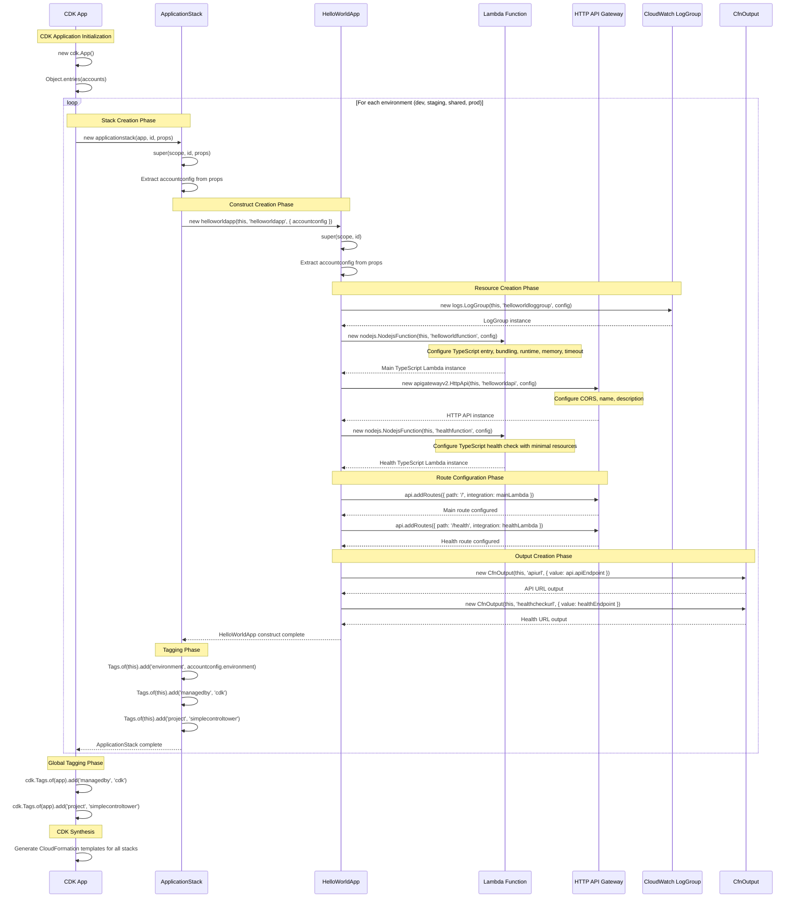

# Application Flow Documentation

This document provides a comprehensive visual representation of how the Hello World serverless application works, from initial setup through AWS Control Tower to user interactions, including script automation and TypeScript stack construction.

## Complete Setup and Deployment Flow

```mermaid
graph TB
    Start["🚀 Start Setup"] --> Prerequisites["📋 Prerequisites Check<br/>Node.js v20+, CDK v2"]
    Prerequisites --> Build["🔨 Build Project<br/>npm run build"]
    Build --> Synth["🔄 CDK Synth<br/>Generate CloudFormation"]
    Synth --> ControlTower["⚙️ Control Tower Setup<br/>(Manual - AWS Console)"]
    
    ControlTower --> GetAccounts["🔍 Get Account IDs<br/>get-account-ids.sh"]
    GetAccounts --> Bootstrap["🛠️ Bootstrap Accounts<br/>bootstrap-accounts.sh"]
    Bootstrap --> Deploy["🚀 Deploy Applications<br/>deploy-applications.sh"]
    Deploy --> Validate["✅ Validate Deployments<br/>validate-deployments.sh"]
    
    GetAccounts --> EnvFile["📄 .env File<br/>Account IDs stored"]
    EnvFile --> Bootstrap
    
    Bootstrap --> DevBootstrap["🔧 Bootstrap Dev Account<br/>CDK Toolkit setup"]
    Bootstrap --> StagingBootstrap["🧪 Bootstrap Staging Account<br/>CDK Toolkit setup"]
    Bootstrap --> SharedBootstrap["🔧 Bootstrap Shared Account<br/>CDK Toolkit setup"]
    Bootstrap --> ProdBootstrap["🚀 Bootstrap Prod Account<br/>CDK Toolkit setup"]
    
    Deploy --> DevDeploy["🔧 Deploy to Dev<br/>helloworld-dev"]
    Deploy --> StagingDeploy["🧪 Deploy to Staging<br/>helloworld-staging"]
    Deploy --> SharedDeploy["🔧 Deploy to Shared<br/>helloworld-shared"]
    Deploy --> ProdDeploy["🚀 Deploy to Prod<br/>helloworld-prod"]
    
    DevDeploy --> DevTest["🧪 Test Dev Endpoint"]
    StagingDeploy --> StagingTest["🧪 Test Staging Endpoint"]
    SharedDeploy --> SharedTest["🧪 Test Shared Endpoint"]
    ProdDeploy --> ProdTest["🧪 Test Prod Endpoint"]
    
    Validate --> ValidationReport["📊 Validation Report<br/>All endpoints tested"]
```



## Architecture Overview Flow

```mermaid
graph TB
    Dev["👨‍💻 Developer"] --> Code["📝 Code Changes"]
    Code --> CDK["🏗️ CDK Deploy"]
    
    CDK --> Synth["🔄 CDK Synth"]
    Synth --> CF["☁️ CloudFormation"]
    
    CF --> LogGroup["📊 CloudWatch Log Group"]
    CF --> Lambda["⚡ Lambda Function"]
    CF --> API["🌐 HTTP API Gateway"]
    CF --> HealthLambda["🏥 Health Check Lambda"]
    CF --> Routes["🛣️ API Routes"]
    CF --> Outputs["📤 CloudFormation Outputs"]
    
    User["👤 User"] --> Request["📱 HTTP Request"]
    Request --> API
    API --> Router{"🔀 Route Handler"}
    
    Router -->|"GET /"| MainRoute["🏠 Main Route Integration"]
    MainRoute --> Lambda
    Lambda --> LogEvent["📝 Log Event"]
    Lambda --> ProcessRequest["⚙️ Process Request"]
    ProcessRequest --> Response["📋 JSON Response"]
    Response --> API
    
    Router -->|"GET /health"| HealthRoute["❤️ Health Route Integration"]
    HealthRoute --> HealthLambda
    HealthLambda --> HealthCheck["🩺 Health Status Check"]
    HealthCheck --> HealthResponse["✅ Health Response"]
    HealthResponse --> API
    
    API --> CORS["🔐 CORS Headers"]
    CORS --> UserResponse["📱 HTTP Response"]
    UserResponse --> User
    
    LogEvent --> LogGroup
    LogGroup --> CloudWatch["☁️ CloudWatch Monitoring"]
```



## Multi-Environment Deployment Flow

```mermaid
graph LR
    Config["📋 accounts.ts Configuration"] --> Loop{"🔄 For Each Environment"}
    
    Loop --> Dev["🔧 Development<br/>128MB, 10s timeout"]
    Loop --> Staging["🧪 Staging<br/>256MB, 15s timeout"]
    Loop --> Shared["🔧 Shared Services<br/>256MB, 15s timeout"]
    Loop --> Prod["🚀 Production<br/>512MB, 30s timeout"]
    
    Dev --> DevAccount["🏢 AWS Account<br/>DEV_ACCOUNT_ID"]
    Staging --> StagingAccount["🏢 AWS Account<br/>STAGING_ACCOUNT_ID"]
    Shared --> SharedAccount["🏢 AWS Account<br/>SHARED_ACCOUNT_ID"]
    Prod --> ProdAccount["🏢 AWS Account<br/>PROD_ACCOUNT_ID"]
    
    DevAccount --> DevStack["📦 helloworld-dev"]
    StagingAccount --> StagingStack["📦 helloworld-staging"]
    SharedAccount --> SharedStack["📦 helloworld-shared"]
    ProdAccount --> ProdStack["📦 helloworld-prod"]
    
    DevStack --> DevResources["⚡ Lambda + API<br/>Cost Optimized"]
    StagingStack --> StagingResources["⚡ Lambda + API<br/>Balanced"]
    SharedStack --> SharedResources["⚡ Lambda + API<br/>Shared Services"]
    ProdStack --> ProdResources["⚡ Lambda + API<br/>High Performance"]
```



## Request Processing Flow (Detailed)


## Scripts Flow

```mermaid
graph TB
    CompleteSetup["🚀 complete-setup.sh<br/>Main orchestration script"]
    
    CompleteSetup --> Check1["✅ Prerequisites Check<br/>Node.js & CDK versions"]
    CompleteSetup --> Check2["🔨 Build Project<br/>npm run build"]
    CompleteSetup --> Check3["🔄 CDK Synth<br/>Generate templates"]
    CompleteSetup --> Check4["⚙️ Control Tower Status<br/>Manual setup required"]
    
    CompleteSetup --> GetIds["🔍 get-account-ids.sh"]
    GetIds --> QueryOrgs["🏢 AWS Organizations Query<br/>List all accounts"]
    QueryOrgs --> ExtractIds["📊 Extract Account IDs<br/>Dev, Staging, Shared, Prod"]
    ExtractIds --> CreateEnv["📄 Create .env file<br/>Store account variables"]
    
    CompleteSetup --> Bootstrap["🛠️ bootstrap-accounts.sh"]
    Bootstrap --> LoadEnv["📄 Load .env file<br/>Read account IDs"]
    Bootstrap --> BootstrapLoop{"🔄 For each account"}
    BootstrapLoop --> BootstrapDev["🔧 Bootstrap Dev<br/>CDK toolkit resources"]
    BootstrapLoop --> BootstrapStaging["🧪 Bootstrap Staging<br/>CDK toolkit resources"]
    BootstrapLoop --> BootstrapShared["🔧 Bootstrap Shared<br/>CDK toolkit resources"]
    BootstrapLoop --> BootstrapProd["🚀 Bootstrap Prod<br/>CDK toolkit resources"]
    
    CompleteSetup --> DeployApps["🚀 deploy-applications.sh"]
    DeployApps --> DeployLoop{"🔄 Deploy to each env"}
    DeployLoop --> DeployDev["🔧 Deploy Dev<br/>helloworld-dev stack"]
    DeployLoop --> DeployStaging["🧪 Deploy Staging<br/>helloworld-staging stack"]
    DeployLoop --> DeployShared["🔧 Deploy Shared<br/>helloworld-shared stack"]
    DeployLoop --> DeployProd["🚀 Deploy Prod<br/>helloworld-prod stack"]
    
    DeployDev --> TestDev["🧪 Test Dev Endpoint<br/>curl health check"]
    DeployStaging --> TestStaging["🧪 Test Staging Endpoint<br/>curl health check"]
    DeployShared --> TestShared["🧪 Test Shared Endpoint<br/>curl health check"]
    DeployProd --> TestProd["🧪 Test Prod Endpoint<br/>curl health check"]
    
    CompleteSetup --> Validate["✅ validate-deployments.sh"]
    Validate --> ValidateLoop{"🔄 For each environment"}
    ValidateLoop --> ValidateEndpoints["🧪 Test All Endpoints<br/>Main + Health checks"]
    ValidateLoop --> CheckEnvMatch["✅ Validate Environment<br/>Response matches expected"]
    ValidateLoop --> GenerateReport["📊 Generate Report<br/>Success/failure summary"]
```



## TypeScript Stack Construction Flow

```mermaid
graph TB
    Entry["🚀 bin/gctone.ts<br/>CDK App Entry Point"]
    
    Entry --> CreateApp["📱 new cdk.App()<br/>Create CDK application"]
    Entry --> LoadAccounts["📋 Import accounts config<br/>from lib/config/accounts.ts"]
    
    LoadAccounts --> AccountsInterface["📝 accountconfig interface<br/>Type definitions"]
    LoadAccounts --> AccountsData["📊 accounts Record<br/>Dev, Staging, Shared, Prod"]
    AccountsData --> DevConfig["🔧 Dev: 128MB, 10s timeout"]
    AccountsData --> StagingConfig["🧪 Staging: 256MB, 15s timeout"]
    AccountsData --> SharedConfig["🔧 Shared: 256MB, 15s timeout"]
    AccountsData --> ProdConfig["🚀 Prod: 512MB, 30s timeout"]
    
    Entry --> EnvLoop{"🔄 Object.entries(accounts)<br/>For each environment"}
    
    EnvLoop --> CreateStack["📦 new applicationstack()<br/>CloudFormation stack boundary"]
    CreateStack --> StackProps["⚙️ Stack Properties<br/>Account ID, Region, Config"]
    StackProps --> EnvVars["🌍 Environment Variables<br/>DEV_ACCOUNT_ID, PROD_ACCOUNT_ID"]
    
    CreateStack --> AppStackClass["📋 applicationstack class<br/>lib/stacks/application-stack.ts"]
    AppStackClass --> ExtractConfig["📊 Extract accountconfig<br/>from props"]
    AppStackClass --> CreateConstruct["🏗️ new helloworldapp()<br/>Instantiate construct"]
    AppStackClass --> ApplyStackTags["🏷️ Apply Stack Tags<br/>Environment, ManagedBy, Project"]
    
    CreateConstruct --> HelloWorldClass["🏗️ helloworldapp class<br/>lib/constructs/hello-world-app.ts"]
    
    HelloWorldClass --> CreateLogGroup["📊 CloudWatch Log Group<br/>Environment-specific retention"]
    HelloWorldClass --> CreateMainLambda["⚡ Main Lambda Function<br/>Node.js 22, ARM64, env config"]
    HelloWorldClass --> CreateAPI["🌐 HTTP API Gateway<br/>CORS enabled, cost-optimized"]
    HelloWorldClass --> CreateHealthLambda["🏥 Health Check Lambda<br/>Minimal 128MB resources"]
    HelloWorldClass --> CreateRoutes["🛣️ API Routes<br/>/ and /health endpoints"]
    HelloWorldClass --> CreateOutputs["📤 CloudFormation Outputs<br/>API and health URLs"]
    
    CreateMainLambda --> LambdaConfig["⚙️ Lambda Configuration<br/>Memory, timeout from accountconfig"]
    CreateMainLambda --> LambdaCode["📝 TypeScript Lambda Code<br/>lib/lambda/main-handler.ts"]
    CreateMainLambda --> EnvVariables["🌍 Environment Variables<br/>ENVIRONMENT, ACCOUNT_NAME, MESSAGE"]
    CreateMainLambda --> BundleConfig["📦 Bundle Optimization<br/>Minify, tree shake, ES2022"]
    
    CreateAPI --> CORSConfig["🔐 CORS Configuration<br/>Allow origins, methods, headers"]
    CreateAPI --> HTTPIntegration["🔗 Lambda Integration<br/>Proxy integration"]
    
    Entry --> GlobalTags["🏷️ Global App Tags<br/>Apply to all stacks"]
    GlobalTags --> ManagedByTag["🏷️ managedby: cdk"]
    GlobalTags --> ProjectTag["🏷️ project: simplecontroltower"]
```



## CDK Code Structure Flow

```mermaid
graph TB
    Entry["🚀 bin/gctone.ts<br/>CDK App Entry Point"]
    
    Entry --> AccountsConfig["📋 lib/config/accounts.ts<br/>Environment Configuration"]
    
    Entry --> StackLoop{"🔄 For Each Environment"}
    StackLoop --> AppStack["📦 lib/stacks/application-stack.ts<br/>CloudFormation Stack"]
    
    AppStack --> HelloWorldConstruct["🏗️ lib/constructs/hello-world-app.ts<br/>HelloWorld Construct"]
    
    HelloWorldConstruct --> LogGroupRes["📊 CloudWatch Log Group<br/>Environment-specific retention"]
    HelloWorldConstruct --> LambdaRes["⚡ Main Lambda Function<br/>Node.js 22, ARM64"]
    HelloWorldConstruct --> APIRes["🌐 HTTP API Gateway<br/>CORS enabled"]
    HelloWorldConstruct --> HealthRes["🏥 Health Check Lambda<br/>Minimal resources"]
    HelloWorldConstruct --> RoutesRes["🛣️ API Routes<br/>/ and /health endpoints"]
    HelloWorldConstruct --> OutputsRes["📤 CloudFormation Outputs<br/>API URLs"]
    
    AppStack --> StackTags["🏷️ Stack Tags<br/>Environment, Project, ManagedBy"]
    Entry --> AppTags["🏷️ App Tags<br/>Global tags for all resources"]
    
    AccountsConfig --> EnvConfig["⚙️ Environment Settings<br/>Memory, Timeout, Messages"]
    EnvConfig --> HelloWorldConstruct
```



## Cost Optimization Strategy Flow

```mermaid
graph LR
    CostOpt["💰 Cost Optimization Strategy"]
    
    CostOpt --> HTTPapi["🌐 HTTP API Gateway<br/>70% cheaper than REST API"]
    CostOpt --> ARM64["🏗️ ARM64 Architecture<br/>20% cheaper than x86"]
    CostOpt --> EnvSizing["📊 Environment-Specific Sizing"]
    CostOpt --> LogRetention["📝 Log Retention Policies"]
    CostOpt --> RemovalPolicy["🗑️ RemovalPolicy.DESTROY<br/>Easy cleanup"]
    
    EnvSizing --> DevSizing["🔧 Development<br/>128MB RAM, 10s timeout<br/>Minimal cost"]
    EnvSizing --> StagingSizing["🧪 Staging<br/>256MB RAM, 15s timeout<br/>Balanced cost/performance"]
    EnvSizing --> SharedSizing["🔧 Shared<br/>256MB RAM, 15s timeout<br/>Stable services"]
    EnvSizing --> ProdSizing["🚀 Production<br/>512MB RAM, 30s timeout<br/>Performance optimized"]
    
    LogRetention --> DevLogs["🔧 Dev/Staging<br/>1 week retention<br/>Cost minimized"]
    LogRetention --> ProdLogs["🚀 Production<br/>1 month retention<br/>Compliance/audit"]
    
    HTTPapi --> Savings1["💰 API Gateway<br/>Cost Reduction"]
    ARM64 --> Savings2["💰 Compute<br/>Cost Reduction"]
    DevSizing --> Savings3["💰 Development<br/>Cost Reduction"]
```



## Function Execution Details

### Main Lambda Function (`handler` export from TypeScript)
- **File**: `lib/lambda/main-handler.ts`
- **Input**: Typed `APIGatewayProxyEvent` from API Gateway
- **Processing**:
  1. Log incoming request for debugging with proper typing
  2. Extract environment information from typed environment variables
  3. Generate strongly-typed response metadata (timestamp, request ID, region)
  4. Include Lambda execution context with type safety (memory, remaining time, architecture)
  5. Format typed JSON response with CORS headers using `ResponseBody` interface
- **Output**: Typed `APIGatewayProxyResult` with environment info and metadata
- **TypeScript Benefits**: 
  - Compile-time error checking prevents runtime errors
  - IntelliSense support with autocomplete and documentation
  - Interface-driven development with `ResponseBody` and `ResponseMetadata`
  - Automatic code completion and refactoring support

### Health Check Lambda Function (`handler` export from TypeScript)
- **File**: `lib/lambda/health-handler.ts`
- **Input**: Typed `APIGatewayProxyEvent` from API Gateway (health endpoint)
- **Processing**:
  1. Simple health status check with typed response structure
  2. Include current timestamp with proper typing
  3. Include Lambda container uptime with type safety
  4. Format minimal typed JSON response using `HealthResponseBody` interface
- **Output**: Typed `APIGatewayProxyResult` with health status
- **TypeScript Benefits**:
  - Type-safe response structure prevents field errors
  - Compile-time validation ensures response consistency
  - Better IDE support with syntax highlighting and error detection

### CDK Functions

#### `accounts.ts` Exports
- **`accountconfig` interface**: Type definition for environment configuration
- **`accounts` object**: Environment-specific configurations (dev, staging, shared, prod)
- **`core_accounts` object**: AWS Control Tower account email mappings

#### `hello-world-app.ts` Exports
- **`helloworldappprops` interface**: Props for HelloWorld construct
- **`helloworldapp` class**: CDK construct that creates all AWS resources

#### `application-stack.ts` Exports
- **`applicationstackprops` interface**: Props for Application stack
- **`applicationstack` class**: CloudFormation stack that orchestrates deployment

#### `gctone.ts` Main Flow
1. Import all dependencies and configurations
2. Create CDK App instance
3. Iterate through each environment configuration
4. Create Application Stack for each environment with account targeting
5. Apply global tags for governance and cost tracking

### Script Functions

#### `complete-setup.sh` - Main Orchestration
1. **Prerequisites Check**: Validates Node.js v20+ and CDK v2 versions
2. **Project Build**: Runs `npm run build` to compile TypeScript
3. **CDK Synthesis**: Generates CloudFormation templates via `cdk synth`
4. **Control Tower Check**: Verifies Control Tower setup (manual step)
5. **Account Discovery**: Calls `get-account-ids.sh` to retrieve account IDs
6. **Bootstrap Process**: Calls `bootstrap-accounts.sh` to prepare accounts
7. **Application Deployment**: Calls `deploy-applications.sh` to deploy stacks
8. **Validation**: Calls `validate-deployments.sh` to test endpoints

#### `get-account-ids.sh` - Account Discovery
1. **AWS Organizations Query**: Lists all accounts in the organization
2. **Account Filtering**: Extracts IDs for Development, Staging, Shared Services, Production
3. **Environment File Creation**: Generates `.env` file with account variables
4. **Management Account**: Retrieves current account ID via `aws sts get-caller-identity`

#### `bootstrap-accounts.sh` - CDK Preparation  
1. **Environment Loading**: Sources `.env` file with account IDs
2. **Account Validation**: Verifies all required account IDs are present
3. **Bootstrap Loop**: For each account (dev, staging, shared, prod):
   - Runs `cdk bootstrap` with account-specific targeting
   - Creates CDK toolkit CloudFormation stack
   - Sets up S3 bucket for CDK assets
   - Creates IAM roles for CloudFormation execution
   - Establishes cross-account trust with management account

#### `deploy-applications.sh` - Application Deployment
1. **Environment Loading**: Sources account IDs from `.env` file
2. **Deployment Loop**: For each environment sequentially:
   - Deploys CloudFormation stack to target account
   - Generates output file with API endpoints
   - Tests deployed endpoint with curl health check
   - Validates response contains expected content

#### `validate-deployments.sh` - Comprehensive Testing
1. **Version Checks**: Validates CDK and Node.js versions
2. **Endpoint Testing**: For each environment:
   - Tests main application endpoint (`GET /`)
   - Tests health check endpoint (`GET /health`)
   - Validates environment-specific response content
   - Checks response timing and HTTP status codes
3. **Report Generation**: Creates summary of all validation results

### TypeScript Stack Construction Process

#### 1. Entry Point Flow (bin/gctone.ts)
- **Application Creation**: `new cdk.App()` creates the root CDK application
- **Configuration Import**: Loads environment configs from `lib/config/accounts.ts`
- **Environment Loop**: `Object.entries(accounts)` iterates through all environments
- **Stack Creation**: Creates `applicationstack` instance for each environment
- **Account Targeting**: Uses environment variables (DEV_ACCOUNT_ID, etc.) for account targeting
- **Global Tagging**: Applies app-level tags for governance and cost tracking

#### 2. Application Stack Construction (lib/stacks/application-stack.ts)
- **Stack Boundary**: Defines CloudFormation stack boundary for deployment
- **Props Extraction**: Extracts `accountconfig` from stack properties
- **Construct Instantiation**: Creates `helloworldapp` construct with configuration
- **Stack-Level Tagging**: Applies environment-specific tags (environment, managedby, project)
- **Configuration Pass-Through**: Forwards account configuration to child constructs

#### 3. HelloWorld Construct Creation (lib/constructs/hello-world-app.ts)
- **Log Group**: Creates CloudWatch log group with environment-specific retention
- **Main Lambda**: Creates TypeScript Lambda function with:
  - Node.js 22 runtime on ARM64 architecture
  - **NodejsFunction** for automatic TypeScript compilation
  - **TypeScript source**: `lib/lambda/main-handler.ts`
  - **Bundle optimization**: minification, tree shaking, ES2022 target
  - Environment-specific memory allocation and timeout
  - Environment variables for runtime configuration
- **HTTP API**: Creates cost-optimized HTTP API Gateway v2 with CORS
- **Health Lambda**: Creates lightweight TypeScript health check Lambda:
  - **TypeScript source**: `lib/lambda/health-handler.ts`
  - **Automatic compilation** with bundle optimization
  - Minimal resources (128MB, 10s timeout)
- **Route Configuration**: Configures API routes for `/` and `/health` endpoints
- **Outputs**: Creates CloudFormation outputs for API and health check URLs

#### 4. Configuration Management (lib/config/accounts.ts)
- **Type Definitions**: `accountconfig` interface ensures type safety
- **Environment Configs**: Four environment configurations with cost optimization:
  - **Development**: 128MB RAM, 10s timeout (minimal cost)
  - **Staging**: 256MB RAM, 15s timeout (balanced cost/performance)
  - **Shared Services**: 256MB RAM, 15s timeout (stable utility services)
  - **Production**: 512MB RAM, 30s timeout (performance optimized)
- **Email Mappings**: AWS Control Tower account email configurations
- **Resource Scaling**: Environment-appropriate resource allocation for cost optimization

## CDK Function Call Flow

```mermaid
graph TB
    Start["🚀 Start: node bin/gctone.js"]
    
    Start --> ImportCDK["📦 import * as cdk from 'aws-cdk-lib'"]
    Start --> ImportAppStack["📦 import { applicationstack }"]
    Start --> ImportAccounts["📦 import { accounts }"]
    
    ImportCDK --> CreateApp["📱 const app = new cdk.App()"]
    CreateApp --> AppConstructor["🔧 cdk.App.constructor()"]
    AppConstructor --> AppInit["⚙️ Initialize CDK Application"]
    
    ImportAccounts --> ObjectEntries["🔄 Object.entries(accounts)"]
    ObjectEntries --> ForEachLoop{"🔁 forEach([key, accountconfig])"}
    
    ForEachLoop --> CreateAppStack["📦 new applicationstack(app, stackName, props)"]
    CreateAppStack --> AppStackConstructor["🔧 applicationstack.constructor()"]
    
    AppStackConstructor --> SuperCall["📞 super(scope, id, props)"]
    SuperCall --> StackConstructor["🔧 cdk.Stack.constructor()"]
    StackConstructor --> StackInit["⚙️ Initialize CloudFormation Stack"]
    
    AppStackConstructor --> ExtractProps["📊 const { accountconfig } = props"]
    ExtractProps --> CreateHelloWorld["🏗️ new helloworldapp(this, 'helloworldapp', { accountconfig })"]
    
    CreateHelloWorld --> HelloWorldConstructor["🔧 helloworldapp.constructor()"]
    HelloWorldConstructor --> HelloWorldSuper["📞 super(scope, id)"]
    HelloWorldSuper --> ConstructInit["⚙️ Initialize CDK Construct"]
    
    HelloWorldConstructor --> ExtractConfig["📊 const { accountconfig } = props"]
    
    ExtractConfig --> CreateLogGroup["📊 new logs.LogGroup()"]
    CreateLogGroup --> LogGroupConstructor["🔧 LogGroup.constructor()"]
    LogGroupConstructor --> LogGroupConfig["⚙️ Configure log retention policy"]
    
    ExtractConfig --> CreateMainLambda["⚡ new nodejs.NodejsFunction()"]
    CreateMainLambda --> NodejsConstructor["🔧 NodejsFunction.constructor()"]
    NodejsConstructor --> LambdaRuntime["⚙️ Set runtime: NODEJS_22_X"]
    NodejsConstructor --> LambdaArch["⚙️ Set architecture: ARM_64"]
    NodejsConstructor --> LambdaEntry["📝 Set entry: lib/lambda/main-handler.ts"]
    NodejsConstructor --> LambdaHandler["🎯 Set handler: handler"]
    NodejsConstructor --> LambdaMemory["⚙️ Set memorySize: accountconfig.memorysize"]
    NodejsConstructor --> LambdaTimeout["⚙️ Set timeout: accountconfig.timeout"]
    NodejsConstructor --> LambdaEnv["⚙️ Set environment variables"]
    NodejsConstructor --> BundleOptions["📦 Set bundling options"]
    BundleOptions --> BundleMinify["🗜️ minify: true"]
    BundleOptions --> BundleSourceMap["🗺️ sourceMap: false"]
    BundleOptions --> BundleTarget["🎯 target: es2022"]
    LambdaEnv --> EnvEnvironment["🌍 ENVIRONMENT: accountconfig.environment"]
    LambdaEnv --> EnvAccountName["🌍 ACCOUNT_NAME: accountconfig.name"]
    LambdaEnv --> EnvMessage["🌍 HELLO_WORLD_MESSAGE: accountconfig.helloworldmessage"]
    
    ExtractConfig --> CreateAPI["🌐 new apigatewayv2.HttpApi()"]
    CreateAPI --> APIConstructor["🔧 HttpApi.constructor()"]
    APIConstructor --> APIName["⚙️ Set apiName"]
    APIConstructor --> APIDescription["⚙️ Set description"]
    APIConstructor --> APICors["⚙️ Configure CORS preflight"]
    APICors --> CorsOrigins["🔐 allowOrigins: ['*']"]
    APICors --> CorsMethods["🔐 allowMethods: [GET, POST]"]
    APICors --> CorsHeaders["🔐 allowHeaders: ['Content-Type', 'Authorization']"]
    APICors --> CorsMaxAge["🔐 maxAge: Duration.days(1)"]
    
    ExtractConfig --> CreateHealthLambda["🏥 new nodejs.NodejsFunction()"]
    CreateHealthLambda --> HealthNodejsConstructor["🔧 NodejsFunction.constructor()"]
    HealthNodejsConstructor --> HealthRuntime["⚙️ Set runtime: NODEJS_22_X"]
    HealthNodejsConstructor --> HealthArch["⚙️ Set architecture: ARM_64"]
    HealthNodejsConstructor --> HealthEntry["📝 Set entry: lib/lambda/health-handler.ts"]
    HealthNodejsConstructor --> HealthHandler["🎯 Set handler: handler"]
    HealthNodejsConstructor --> HealthMemory["⚙️ Set memorySize: 128"]
    HealthNodejsConstructor --> HealthTimeout["⚙️ Set timeout: 10 seconds"]
    HealthNodejsConstructor --> HealthEnv["⚙️ Set environment: ENVIRONMENT"]
    HealthNodejsConstructor --> HealthBundleOptions["📦 Set bundling options"]
    HealthBundleOptions --> HealthBundleMinify["🗜️ minify: true"]
    HealthBundleOptions --> HealthBundleSourceMap["🗺️ sourceMap: false"]
    HealthBundleOptions --> HealthBundleTarget["🎯 target: es2022"]
    
    CreateAPI --> AddMainRoute["🛣️ api.addRoutes()"]
    AddMainRoute --> MainRouteConfig["⚙️ Configure main route"]
    MainRouteConfig --> MainPath["📍 path: '/'"]
    MainRouteConfig --> MainMethod["📡 methods: [HttpMethod.GET]"]
    MainRouteConfig --> MainIntegration["🔗 integration: HttpLambdaIntegration"]
    MainIntegration --> MainLambdaIntegration["🔗 new HttpLambdaIntegration('rootintegration', this.lambda)"]
    
    CreateHealthLambda --> AddHealthRoute["🛣️ api.addRoutes()"]
    AddHealthRoute --> HealthRouteConfig["⚙️ Configure health route"]
    HealthRouteConfig --> HealthPath["📍 path: '/health'"]
    HealthRouteConfig --> HealthMethod["📡 methods: [HttpMethod.GET]"]
    HealthRouteConfig --> HealthIntegration["🔗 integration: HttpLambdaIntegration"]
    HealthIntegration --> HealthLambdaIntegration["🔗 new HttpLambdaIntegration('healthintegration', healthlambda)"]
    
    CreateAPI --> CreateAPIOutput["📤 new CfnOutput()"]
    CreateAPIOutput --> APIOutputConstructor["🔧 CfnOutput.constructor()"]
    APIOutputConstructor --> APIOutputValue["📍 value: this.api.apiEndpoint"]
    APIOutputConstructor --> APIOutputDescription["📝 description: 'Hello World API URL'"]
    APIOutputConstructor --> APIOutputExport["📤 exportName: 'helloworldapiurl-{env}'"]
    
    CreateHealthLambda --> CreateHealthOutput["📤 new CfnOutput()"]
    CreateHealthOutput --> HealthOutputConstructor["🔧 CfnOutput.constructor()"]
    HealthOutputConstructor --> HealthOutputValue["📍 value: '{api.apiEndpoint}/health'"]
    HealthOutputConstructor --> HealthOutputDescription["📝 description: 'Health check URL'"]
    
    CreateHelloWorld --> ApplyStackTags["🏷️ Apply Stack Tags"]
    ApplyStackTags --> EnvironmentTag["🏷️ Tags.of(this).add('environment', accountconfig.environment)"]
    ApplyStackTags --> ManagedByTag["🏷️ Tags.of(this).add('managedby', 'cdk')"]
    ApplyStackTags --> ProjectTag["🏷️ Tags.of(this).add('project', 'simplecontroltower')"]
    
    ForEachLoop --> NextIteration{"🔄 Next Environment?"}
    NextIteration -->|Yes| CreateAppStack
    NextIteration -->|No| ApplyGlobalTags["🏷️ Apply Global App Tags"]
    
    ApplyGlobalTags --> GlobalManagedBy["🏷️ cdk.Tags.of(app).add('managedby', 'cdk')"]
    ApplyGlobalTags --> GlobalProject["🏷️ cdk.Tags.of(app).add('project', 'simplecontroltower')"]
    
    ApplyGlobalTags --> CDKSynth["🔄 CDK Synthesis Process"]
    CDKSynth --> GenerateTemplates["📄 Generate CloudFormation Templates"]
    GenerateTemplates --> StackTemplates["📄 4 Stack Templates Generated"]
    StackTemplates --> DevTemplate["📄 helloworld-dev.template.json"]
    StackTemplates --> StagingTemplate["📄 helloworld-staging.template.json"]
    StackTemplates --> SharedTemplate["📄 helloworld-shared.template.json"]
    StackTemplates --> ProdTemplate["📄 helloworld-prod.template.json"]
    
    style Start fill:#e1f5fe
    style CreateApp fill:#f3e5f5
    style CreateAppStack fill:#e8f5e8
    style CreateHelloWorld fill:#fff3e0
    style CreateMainLambda fill:#fce4ec
    style CreateAPI fill:#e0f2f1
    style CreateHealthLambda fill:#fff8e1
    style CDKSynth fill:#f1f8e9
```



## Method Call Sequence



## TypeScript Lambda Development Benefits

### 🚀 **Modern Development Experience**
- **Type Safety**: Compile-time error checking prevents runtime issues
- **IDE Support**: Full IntelliSense, autocomplete, and refactoring capabilities
- **Interface-Driven**: Strongly typed request/response structures
- **Developer Productivity**: Faster development with better tooling

### 📦 **Automatic Build Pipeline**
- **NodejsFunction**: CDK automatically compiles TypeScript to JavaScript
- **esbuild Integration**: Fast bundling with tree shaking and minification
- **Bundle Optimization**: Smaller Lambda packages for faster cold starts
- **Modern JavaScript**: ES2022 targeting for better performance

### 🏗️ **Architecture Improvements**
- **External Files**: Organized code structure vs inline JavaScript
- **Version Control**: Clean Git diffs and better collaboration
- **Testing**: Easier unit testing with proper TypeScript modules
- **Maintenance**: Better code organization and documentation

### 📊 **Lambda Function Structure**

```typescript
// lib/lambda/main-handler.ts
export const handler = async (
  event: APIGatewayProxyEvent,
  context: Context
): Promise<APIGatewayProxyResult> => {
  // Fully typed Lambda function with IntelliSense support
};
```

### 🔄 **CDK Integration**
```typescript
// NodejsFunction automatically handles TypeScript compilation
new nodejs.NodejsFunction(this, "function", {
  entry: "lib/lambda/main-handler.ts",   // TypeScript source
  handler: "handler",                    // Export name
  bundling: {
    minify: true,                        // Optimize bundle
    target: "es2022"                     // Modern JavaScript
  }
});
```

This comprehensive flow documentation helps understand how the application works from initial setup through AWS Control Tower to production deployment, including the automation scripts, TypeScript stack construction, detailed function call flows, modern TypeScript development benefits, cost optimization strategies, and multi-environment deployment patterns.