# Application Flow Documentation

This document provides a comprehensive visual representation of how the Hello World serverless application works, from code deployment to user interactions.

## Architecture Overview Flow

```mermaid
graph TB
    Dev["👨‍💻 Developer"] --> Code["📝 Code Changes"]
    Code --> CDK["🏗️ CDK Deploy"]
    
    CDK --> Synth["🔄 CDK Synth"]
    Synth --> CF["☁️ CloudFormation"]
    
    CF --> LogGroup["📊 CloudWatch Log Group"]
    CF --> Lambda["⚡ Lambda Function"]
    CF --> API["🌐 HTTP API Gateway"]
    CF --> HealthLambda["🏥 Health Check Lambda"]
    CF --> Routes["🛣️ API Routes"]
    CF --> Outputs["📤 CloudFormation Outputs"]
    
    User["👤 User"] --> Request["📱 HTTP Request"]
    Request --> API
    API --> Router{"🔀 Route Handler"}
    
    Router -->|"GET /"| MainRoute["🏠 Main Route Integration"]
    MainRoute --> Lambda
    Lambda --> LogEvent["📝 Log Event"]
    Lambda --> ProcessRequest["⚙️ Process Request"]
    ProcessRequest --> Response["📋 JSON Response"]
    Response --> API
    
    Router -->|"GET /health"| HealthRoute["❤️ Health Route Integration"]
    HealthRoute --> HealthLambda
    HealthLambda --> HealthCheck["🩺 Health Status Check"]
    HealthCheck --> HealthResponse["✅ Health Response"]
    HealthResponse --> API
    
    API --> CORS["🔐 CORS Headers"]
    CORS --> UserResponse["📱 HTTP Response"]
    UserResponse --> User
    
    LogEvent --> LogGroup
    LogGroup --> CloudWatch["☁️ CloudWatch Monitoring"]
```

## Multi-Environment Deployment Flow

```mermaid
graph LR
    Config["📋 accounts.ts Configuration"] --> Loop{"🔄 For Each Environment"}
    
    Loop --> Dev["🔧 Development<br/>128MB, 10s timeout"]
    Loop --> Staging["🧪 Staging<br/>256MB, 15s timeout"]
    Loop --> Shared["🔧 Shared Services<br/>256MB, 15s timeout"]
    Loop --> Prod["🚀 Production<br/>512MB, 30s timeout"]
    
    Dev --> DevAccount["🏢 AWS Account<br/>DEV_ACCOUNT_ID"]
    Staging --> StagingAccount["🏢 AWS Account<br/>STAGING_ACCOUNT_ID"]
    Shared --> SharedAccount["🏢 AWS Account<br/>SHARED_ACCOUNT_ID"]
    Prod --> ProdAccount["🏢 AWS Account<br/>PROD_ACCOUNT_ID"]
    
    DevAccount --> DevStack["📦 helloworld-dev"]
    StagingAccount --> StagingStack["📦 helloworld-staging"]
    SharedAccount --> SharedStack["📦 helloworld-shared"]
    ProdAccount --> ProdStack["📦 helloworld-prod"]
    
    DevStack --> DevResources["⚡ Lambda + API<br/>Cost Optimized"]
    StagingStack --> StagingResources["⚡ Lambda + API<br/>Balanced"]
    SharedStack --> SharedResources["⚡ Lambda + API<br/>Shared Services"]
    ProdStack --> ProdResources["⚡ Lambda + API<br/>High Performance"]
```

## Request Processing Flow (Detailed)

## CDK Code Structure Flow

```mermaid
graph TB
    Entry["🚀 bin/gctone.ts<br/>CDK App Entry Point"]
    
    Entry --> AccountsConfig["📋 lib/config/accounts.ts<br/>Environment Configuration"]
    
    Entry --> StackLoop{"🔄 For Each Environment"}
    StackLoop --> AppStack["📦 lib/stacks/application-stack.ts<br/>CloudFormation Stack"]
    
    AppStack --> HelloWorldConstruct["🏗️ lib/constructs/hello-world-app.ts<br/>HelloWorld Construct"]
    
    HelloWorldConstruct --> LogGroupRes["📊 CloudWatch Log Group<br/>Environment-specific retention"]
    HelloWorldConstruct --> LambdaRes["⚡ Main Lambda Function<br/>Node.js 22, ARM64"]
    HelloWorldConstruct --> APIRes["🌐 HTTP API Gateway<br/>CORS enabled"]
    HelloWorldConstruct --> HealthRes["🏥 Health Check Lambda<br/>Minimal resources"]
    HelloWorldConstruct --> RoutesRes["🛣️ API Routes<br/>/ and /health endpoints"]
    HelloWorldConstruct --> OutputsRes["📤 CloudFormation Outputs<br/>API URLs"]
    
    AppStack --> StackTags["🏷️ Stack Tags<br/>Environment, Project, ManagedBy"]
    Entry --> AppTags["🏷️ App Tags<br/>Global tags for all resources"]
    
    AccountsConfig --> EnvConfig["⚙️ Environment Settings<br/>Memory, Timeout, Messages"]
    EnvConfig --> HelloWorldConstruct
```

## Cost Optimization Strategy Flow

```mermaid
graph LR
    CostOpt["💰 Cost Optimization Strategy"]
    
    CostOpt --> HTTPapi["🌐 HTTP API Gateway<br/>70% cheaper than REST API"]
    CostOpt --> ARM64["🏗️ ARM64 Architecture<br/>20% cheaper than x86"]
    CostOpt --> EnvSizing["📊 Environment-Specific Sizing"]
    CostOpt --> LogRetention["📝 Log Retention Policies"]
    CostOpt --> RemovalPolicy["🗑️ RemovalPolicy.DESTROY<br/>Easy cleanup"]
    
    EnvSizing --> DevSizing["🔧 Development<br/>128MB RAM, 10s timeout<br/>Minimal cost"]
    EnvSizing --> StagingSizing["🧪 Staging<br/>256MB RAM, 15s timeout<br/>Balanced cost/performance"]
    EnvSizing --> SharedSizing["🔧 Shared<br/>256MB RAM, 15s timeout<br/>Stable services"]
    EnvSizing --> ProdSizing["🚀 Production<br/>512MB RAM, 30s timeout<br/>Performance optimized"]
    
    LogRetention --> DevLogs["🔧 Dev/Staging<br/>1 week retention<br/>Cost minimized"]
    LogRetention --> ProdLogs["🚀 Production<br/>1 month retention<br/>Compliance/audit"]
    
    HTTPapi --> Savings1["💰 API Gateway<br/>Cost Reduction"]
    ARM64 --> Savings2["💰 Compute<br/>Cost Reduction"]
    DevSizing --> Savings3["💰 Development<br/>Cost Reduction"]
```

## Function Execution Details

### Main Lambda Function (`exports.handler`)
- **Input**: HTTP event from API Gateway
- **Processing**:
  1. Log incoming request for debugging
  2. Extract environment information from configuration
  3. Generate response metadata (timestamp, request ID, region)
  4. Include Lambda execution context (memory, remaining time, architecture)
  5. Format JSON response with CORS headers
- **Output**: HTTP response with environment info and metadata

### Health Check Lambda Function (`exports.handler`)
- **Input**: HTTP event from API Gateway (health endpoint)
- **Processing**:
  1. Simple health status check
  2. Include current timestamp
  3. Include Lambda container uptime
  4. Format minimal JSON response
- **Output**: HTTP response with health status

### CDK Functions

#### `accounts.ts` Exports
- **`accountconfig` interface**: Type definition for environment configuration
- **`accounts` object**: Environment-specific configurations (dev, staging, shared, prod)
- **`core_accounts` object**: AWS Control Tower account email mappings

#### `hello-world-app.ts` Exports
- **`helloworldappprops` interface**: Props for HelloWorld construct
- **`helloworldapp` class**: CDK construct that creates all AWS resources

#### `application-stack.ts` Exports
- **`applicationstackprops` interface**: Props for Application stack
- **`applicationstack` class**: CloudFormation stack that orchestrates deployment

#### `gctone.ts` Main Flow
1. Import all dependencies and configurations
2. Create CDK App instance
3. Iterate through each environment configuration
4. Create Application Stack for each environment with account targeting
5. Apply global tags for governance and cost tracking

This comprehensive flow documentation helps understand how the application works from development to production, including the cost optimization strategies and multi-environment deployment patterns.