# 🚀 CI/CD Pipeline Reference

Complete reference for the GitHub Actions CI/CD pipeline with workflow examples and deployment strategies.

## 🏗️ **Pipeline Architecture**

```mermaid
graph TB
    subgraph "🔄 CI/CD Flow"
        PR["📝 Pull Request"] --> CI["✅ CI Validation"]
        CI --> Merge["🔀 Merge to Main"]
        Merge --> DevDeploy["🎯 Auto Deploy Dev"]
        DevDeploy --> StagingApproval["👤 Manual: Staging"]
        StagingApproval --> StagingDeploy["🧪 Deploy Staging"]
        StagingDeploy --> ProdApproval["👤 Manual: Production"]
        ProdApproval --> ProdDeploy["🚀 Deploy Production"]
    end
    
    subgraph "🔍 Validation Gates"
        CI --> Tests["🧪 Unit Tests"]
        CI --> Lint["📝 Code Linting"]
        CI --> Security["🔒 Security Scan"]
        CI --> Cost["💰 Cost Analysis"]
    end
```



## 📁 **Workflow Files**

| File | Trigger | Purpose |
|------|---------|---------|
| `ci.yml` | PR, Push to main | Code validation and testing |
| `deploy-dev.yml` | Merge to main | Automatic dev deployment |
| `deploy-staging.yml` | Manual | Staging deployment with approval |
| `deploy-production.yml` | Manual | Production deployment with gates |
| `cost-optimization.yml` | Schedule, Manual | Cost management automation |

## 🔧 **CI Pipeline (`ci.yml`)**

### Triggers
```yaml
on:
  pull_request:
    branches: [main, develop]
  push:
    branches: [main, develop]
```

### Jobs Overview
1. **Code Validation** - Linting, TypeScript, tests
2. **CDK Diff Analysis** - Infrastructure change preview
3. **Security Scan** - Vulnerability and secret detection
4. **Cost Analysis** - Impact estimation

### Sample Output
```bash
✅ ESLint: No issues found
✅ TypeScript: Compilation successful  
✅ Unit Tests: 15/15 passed
✅ CDK Synthesis: Templates generated
✅ Security Scan: No vulnerabilities
✅ Cost Impact: +$0.10/month
```

## 🎯 **Development Deployment (`deploy-dev.yml`)**

### Automatic Trigger
```bash
# Triggered on every merge to main
git push origin main
```

### Deployment Steps
```bash
1. Build & Test (2 min)
2. AWS Authentication (30s)
3. CDK Deployment (3 min)
4. Health Checks (2 min)
5. Integration Tests (2 min)
6. Performance Baseline (1 min)

Total: ~8-10 minutes
```

### Environment Configuration
- **Account**: 803133978889 (Development)
- **Memory**: 128MB (cost-optimized)
- **Timeout**: 30 seconds
- **Architecture**: ARM64

## 🧪 **Staging Deployment (`deploy-staging.yml`)**

### Manual Trigger
```bash
# GitHub Actions → Deploy to Staging
# Parameters:
git_ref: main
source_environment: development
skip_tests: false
```

### Approval Gates
1. **Pre-deployment Validation** - Automated checks
2. **Manual Approval** - Human review required
3. **Comprehensive Testing** - Full validation suite

### Testing Suite
```bash
💨 Smoke Tests: Basic endpoint availability
🧪 Integration Tests: API structure validation
📊 Performance Tests: Load testing (10 concurrent)
🔒 Security Tests: CORS, HTTPS, headers
```

### Environment Configuration
- **Account**: 521744733620 (Staging)
- **Memory**: 256MB (balanced)
- **Timeout**: 60 seconds
- **Architecture**: ARM64

## 🚀 **Production Deployment (`deploy-production.yml`)**

### Prerequisites
- Release tag required (e.g., `v1.0.0`)
- Staging validation passed
- Business approval obtained

### Multi-Gate Approval
```bash
1. Pre-production Validation
   ├── Git tag validation
   ├── Staging health check
   ├── Security compliance
   └── Change management

2. Production Approval Gate
   ├── Senior developer approval
   ├── DevOps lead approval
   └── Business stakeholder approval

3. Deployment Execution
   ├── Backup creation
   ├── Blue-green deployment
   ├── Health validation
   └── Performance verification
```

### Deployment Strategies
```yaml
# Standard deployment (default)
deployment_strategy: standard

# Blue-green deployment
deployment_strategy: blue-green

# Canary deployment  
deployment_strategy: canary
```

### Environment Configuration
- **Account**: 668427974646 (Production)
- **Memory**: 512MB (performance-optimized)
- **Timeout**: 120 seconds
- **Architecture**: ARM64

### Automatic Rollback
```bash
# Triggers automatic rollback if:
- Health checks fail after 30 attempts
- Performance validation fails
- Error rate exceeds threshold
- Manual intervention required
```

## 💰 **Cost Optimization (`cost-optimization.yml`)**

### Scheduled Cleanup
```bash
# Weekdays: 6 PM Singapore time (10 AM UTC)
- cron: '0 10 * * 1-5'

# Weekends: Full cleanup at midnight UTC
- cron: '0 0 * * 6-0'
```

### Optimization Levels
```bash
# Smart cleanup (default)
optimization_level: smart
└── Destroys applications, keeps infrastructure
└── 99% cost savings
└── 2-minute restore time

# Deep cleanup
optimization_level: deep  
└── Destroys everything except Control Tower
└── 99% cost savings
└── 15-minute restore time

# Nuclear option
optimization_level: nuclear
└── Complete environment destruction
└── Maximum savings
└── Full rebuild required
```

### Environment Matrix
```yaml
strategy:
  matrix:
    environment: [development, staging, shared]
  fail-fast: false
```

## 🔐 **Security & Authentication**

### OIDC Configuration
```yaml
permissions:
  id-token: write
  contents: read

- name: Configure AWS credentials
  uses: aws-actions/configure-aws-credentials@v4
  with:
    role-to-assume: arn:aws:iam::ACCOUNT_ID:role/GitHubActions-ENVIRONMENT-Role
    aws-region: ap-southeast-1
```

### Account Role Mapping
```bash
# Development
arn:aws:iam::803133978889:role/GitHubActions-Dev-Role

# Staging  
arn:aws:iam::521744733620:role/GitHubActions-Staging-Role

# Production
arn:aws:iam::668427974646:role/GitHubActions-Production-Role

# Shared
arn:aws:iam::216665870694:role/GitHubActions-Shared-Role
```

## 🧪 **Example: Complete Feature Flow**

### 1. Feature Development
```bash
# Create feature branch
git checkout -b feature/add-version-endpoint

# Make changes to code
# Add tests
# Update documentation

# Commit changes
git add .
git commit -m "feat: add /version endpoint with build info"
git push origin feature/add-version-endpoint
```

### 2. Pull Request & CI
```bash
# Create PR triggers:
✅ Code validation (5 min)
✅ CDK diff analysis
✅ Security scanning
✅ Cost impact analysis

# CI Results posted to PR:
"✅ All checks passed! Ready for review."
```

### 3. Code Review & Merge
```bash
# After approval, merge to main triggers:
🎯 Automatic development deployment (8 min)
✅ Health checks pass
✅ Integration tests pass
✅ Performance baseline established
```

### 4. Staging Promotion
```bash
# Manual trigger staging deployment:
# GitHub Actions → Deploy to Staging
# ├── git_ref: main
# ├── source_environment: development  
# └── skip_tests: false

⏳ Staging deployment (14 min)
✅ Comprehensive validation suite
✅ UAT environment ready
```

### 5. Production Release
```bash
# Create release tag
git tag -a v1.1.0 -m "Release v1.1.0: Add version endpoint"
git push origin v1.1.0

# Manual trigger production deployment:
# GitHub Actions → Deploy to Production
# ├── git_ref: v1.1.0
# ├── source_environment: staging
# ├── deployment_strategy: standard
# └── rollback_enabled: true

🚀 Production deployment (18 min)
✅ Multi-gate approval process
✅ Health validation (30 attempts)
✅ Performance verification
✅ Deployment record created
```

## 📊 **Monitoring & Metrics**

### Deployment Metrics
```bash
📈 Key Performance Indicators:
├── Deployment frequency: Multiple per day
├── Lead time: 2 days (commit to production)
├── Change failure rate: <5%
├── Recovery time: <30 minutes (automatic rollback)

⏱️ Pipeline Timings:
├── CI validation: 5 minutes
├── Development deployment: 8 minutes
├── Staging deployment: 14 minutes
├── Production deployment: 18 minutes
```

### Cost Tracking
```bash
💰 Monthly Cost Impact:
├── Development: +$0.10 per feature
├── Staging: +$0.15 per feature
├── Production: +$0.20 per feature
├── Total impact: <2% of infrastructure budget

📊 Optimization Results:
├── Active state: $35-70/month
├── Optimized state: $0.10/month
├── Savings: 99% cost reduction
```

## 🛠️ **Customization Guide**

### Adding New Environments
```yaml
# 1. Update account configuration
# lib/config/accounts.ts

# 2. Create new workflow file
# .github/workflows/deploy-ENVIRONMENT.yml

# 3. Add OIDC provider and IAM role
# In target AWS account

# 4. Update cost optimization matrix
# .github/workflows/cost-optimization.yml
```

### Environment-Specific Configuration
```typescript
// lib/config/accounts.ts
export const accountconfigs: { [key: string]: accountconfig } = {
  dev: {
    environment: "dev",
    memorysize: 128,      // Cost-optimized
    timeout: 30,
    ctonemessage: "Hello from Development!"
  },
  
  staging: {
    environment: "staging", 
    memorysize: 256,      // Balanced
    timeout: 60,
    ctonemessage: "Hello from Staging!"
  },
  
  prod: {
    environment: "prod",
    memorysize: 512,      // Performance-optimized
    timeout: 120,
    ctonemessage: "Hello from Production!"
  }
};
```

### Custom Approval Gates
```yaml
# Add additional approval environments
environment: custom-approval

# Modify approval conditions
if: |
  needs.validation.outputs.passed == 'true' &&
  github.actor == 'authorized-deployer' &&
  contains(inputs.git_ref, 'release/')
```

## 🚨 **Troubleshooting**

### Common Issues

#### CI Pipeline Failures
```bash
# Authentication issues
- Check OIDC provider configuration
- Verify IAM role trust policies
- Confirm repository settings

# Build failures  
- Review Node.js version compatibility
- Check dependency conflicts
- Validate CDK synthesis
```

#### Deployment Issues
```bash
# CDK deployment failures
- Verify account bootstrap status
- Check CloudFormation stack limits
- Review IAM permissions

# Health check failures
- Confirm Lambda function deployment
- Verify API Gateway configuration  
- Check CloudWatch logs
```

#### Cost Optimization Issues
```bash
# Cleanup failures
- Verify stack exists before destruction
- Check CloudFormation dependencies
- Review retention policies

# Restoration issues
- Confirm CDK bootstrap status
- Verify account permissions
- Check stack naming conventions
```

---

**🎯 This pipeline provides enterprise-grade CI/CD automation with security, cost optimization, and comprehensive testing built-in!**